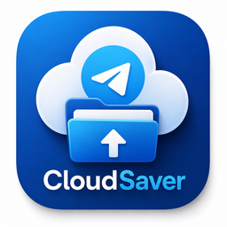

<div align="center">



# CloudSaver

### Turn your Telegram into unlimited free cloud storage.

A polished Electron desktop app that uses your private Telegram channel as the storage backend — no subscriptions, no quotas, no vendor lock-in.

[](../../releases/latest)
[](LICENSE)
[](https://electronjs.org)
[](https://react.dev)
[](https://www.typescriptlang.org)

</div>

---

## Why CloudSaver?

You shouldn't have to choose between **price**, **privacy**, and **reliability**. Most consumer cloud-storage products force a trade-off — pay an ever-increasing subscription, accept arbitrary quotas, and let a third party scan your files. CloudSaver takes a different path: it treats **your own private Telegram channel** as the storage backend, and turns this Electron desktop app into a fast, native file manager that sits on top of it.

The result is a cloud locker that you genuinely **own**, that you can move between devices effortlessly, and that you never have to renew.

---

## Comparison

| Feature                       | **CloudSaver**            | Google Drive          | Dropbox            | MEGA               | OneDrive           |
| ----------------------------- | ------------------------- | --------------------- | ------------------ | ------------------ | ------------------ |
| **Free storage**              | Effectively **unlimited** | 15 GB                 | 2 GB               | 20 GB              | 5 GB               |
| **Monthly cost (1 TB)**       | **$0**                    | ~$10                  | ~$12               | ~$10               | ~$7                |
| **Vendor lock-in**            | None — bring your key     | Heavy                 | Heavy              | Medium             | Heavy              |
| **Files scanned for ads/AI**  | No                        | Yes                   | Limited            | No                 | Yes                |
| **Works offline-first**       | Yes (local-first writes)  | No                    | Partial            | No                 | Partial            |
| **Open source client**        | **Yes**                   | No                    | No                 | Partial            | No                 |
| **Native desktop app**        | Yes (Electron)            | Yes                   | Yes                | Yes                | Yes                |
| **Auto-sync folders**         | Yes (configurable)        | Yes                   | Yes                | Yes                | Yes                |
| **Per-file size limit**       | 2 GB                      | 5 TB                  | 50 GB              | No hard limit      | 250 GB             |
| **Single-string portability** | **Yes (32-char key)**     | No                    | No                 | No                 | No                 |
| **Subscription required**     | **Never**                 | For >15 GB            | For >2 GB          | For >20 GB         | For >5 GB          |

> **Verdict:** if you already use Telegram, CloudSaver gives you a generous, portable, zero-cost cloud locker that respects your data — and a polished UI that doesn't feel like a script.

---

## Features

- **Drag & drop multi-file uploads** — queue dozens of files at once, watch them go up in parallel.
- **Real-time progress bar** — bytes-accurate progress streamed from gramjs over IPC. No more "stuck at 90%".
- **Auto-Sync engine** — point CloudSaver at any folder (Pictures, Downloads, Documents, custom paths) and it watches the filesystem with `chokidar` and uploads new files automatically.
  - Two modes: **Sync All** (default folders) or **Custom Paths**.
  - File-extension filters and exclude-pattern support (`node_modules`, `.git`, etc.).
- **Portable 32-character key** — your entire library is addressed by one short string. Reinstall Windows, switch laptops, paste the key, your files reappear.
- **AES-256-CBC encrypted local session** — API credentials, StringSession and channel token are encrypted at rest using a key derived from your machine fingerprint.
- **Native file dialogs** — uses Electron's `webUtils.getPathForFile()` and `dialog:pick-file` for proper Windows path resolution.
- **Glass-morphism UI** — clean, modern, dark-mode-first interface with dashboard, file list, search and preview.
- **No backend server** — CloudSaver is a thin client. There is no CloudSaver datacenter, no analytics, no telemetry.
- **2 GB-aware** — files over 2 GB are flagged up front (Telegram's per-file cap). Splitting roadmap below.

---

## Screenshots

> Add your own screenshots to `resources/` and link them here. Suggested shots:
> 1. Login screen with API credential prompt
> 2. Key choice screen (`enter existing key` vs `generate new`)
> 3. Dashboard with multi-file drag-and-drop area
> 4. Auto-Sync settings panel
> 5. File list with search

---

## Architecture

```
+-------------------------------------------------------------+
|                       CloudSaver Client                      |
|  (Electron 33 main process + React 18 renderer + TS)         |
+----------------------+--------------------------------------+
                       |
       +---------------+--------------+----------------------+
       |               |              |                      |
       v               v              v                      v
+-------------+  +-----------+  +-----------+         +-------------+
|  IPC Bridge |  | Auto-Sync |  | Storage   |         |  Telegram   |
| (preload.ts)|  | (chokidar)|  | (AES-256) |         |  Service    |
+-------------+  +-----------+  +-----------+         |  (gramjs)   |
                                                      +------+------+
                                                             |
                                                             v
                                                   +---------+----------+
                                                   |  Telegram MTProto  |
                                                   |  Private Channel   |
                                                   +--------------------+
```

**Process model**

- **Main process** (`electron/main/`) — owns the Telegram client, the auto-sync watcher, encrypted storage, and all IPC handlers.
- **Preload** (`electron/preload/index.ts`) — exposes a typed, narrow `electronAPI` surface to the renderer via `contextBridge`. No `nodeIntegration` in the renderer.
- **Renderer** (`src/`) — React + TypeScript. Talks to the main process exclusively through the IPC bridge.

**Upload progress (the fix)**

```
Renderer ── invoke('telegram:upload-file', path) ──▶ Main
                                                       │
                                                       ▼
                                  client.sendFile({progressCallback})
                                                       │
        ◀── on('telegram:upload-progress', {percent}) ─┤  (streamed each chunk)
        ◀── on('telegram:upload-progress', {100}) ─────┤  (final pulse)
        ◀── invoke resolves with {success, data} ──────┘
```

---

## Tech Stack

| Layer       | Choice                          | Why                                                               |
| ----------- | ------------------------------- | ----------------------------------------------------------------- |
| Shell       | **Electron 33**                 | Mature, single-codebase desktop runtime, native Windows packaging |
| Bundler     | **electron-vite**               | Fast HMR for both main and renderer, clean separation of contexts |
| UI          | **React 18 + TypeScript 5**     | Industry-standard, type-safe component model                      |
| Telegram    | **gramjs (`telegram@2.x`)**     | Official MTProto client, supports `progressCallback` on uploads   |
| File watch  | **chokidar 5**                  | Cross-platform, battle-tested filesystem watcher for auto-sync    |
| Crypto      | **node:crypto AES-256-CBC**     | Built-in, FIPS-grade, no third-party crypto dependencies          |
| Packaging   | **electron-builder 25 (NSIS)**  | One-click Windows installer + portable .exe                       |
| Big numbers | **big-integer**                 | Safe handling of Telegram's 64-bit channel/message IDs            |

---

## Installation

### Windows (recommended)

1. Go to the **[Releases page](../../releases/latest)**.
2. Download one of:
   - `CloudSaver-Setup-1.0.0.exe` — NSIS installer (creates Start Menu entry, uninstaller).
   - `CloudSaver-1.0.0.exe` — portable build, no install needed.
3. Run it. Windows SmartScreen may flash a warning because the binary isn't code-signed yet — click **More info → Run anyway**.

### First-run flow

1. Get a Telegram **API ID** and **API Hash** from [my.telegram.org](https://my.telegram.org) → API development tools.
2. Open CloudSaver. Paste your API ID, API Hash, and phone number.
3. Enter the OTP Telegram sends you (and your 2FA password if enabled).
4. Choose:
   - **I'm new** → CloudSaver creates a private channel and gives you a 32-character **key**. Save this key.
   - **I have a key** → Paste an existing key to recover your previous library on this device.
5. You're in. Drag files onto the dashboard or enable Auto-Sync from the toolbar.

> Your CloudSaver key is the master credential for your storage. Treat it like the master password of a password manager — write it down, store it offline, and never share it.

---

## Build from source

Requirements: Node 20, Yarn 1.x, Linux or Windows build host.

```bash
git clone https://github.com/vikrant-project/cloudsaver-telegram-storage.git
cd cloudsaver-telegram-storage

yarn install
yarn electron-vite build
yarn electron-builder --win --x64
```

Outputs land in `dist/`:

- `dist/CloudSaver Setup 1.0.0.exe` — NSIS installer
- `dist/CloudSaver 1.0.0.exe` — portable build

**Dev mode** (hot-reload main + renderer):

```bash
yarn dev
```

---

## Project structure

```
cloudsaver-telegram-storage/
├── electron/
│   ├── main/
│   │   ├── index.ts              # IPC handlers, window lifecycle
│   │   ├── telegram-service.ts   # gramjs client, sendFile w/ progressCallback
│   │   ├── auto-sync-service.ts  # chokidar watcher, upload queue
│   │   └── storage-service.ts    # AES-256-CBC encrypted session storage
│   └── preload/
│       └── index.ts              # contextBridge surface
├── src/
│   ├── App.tsx
│   ├── main.tsx
│   ├── components/
│   │   ├── LoginScreen.tsx
│   │   ├── KeyChoiceScreen.tsx
│   │   ├── Dashboard.tsx
│   │   ├── FileUpload.tsx        # drag-drop + real progress
│   │   ├── FileList.tsx
│   │   └── AutoSyncSettings.tsx
│   ├── styles/                   # glass-morphism CSS
│   └── types/electron.d.ts       # typed IPC surface
├── resources/                    # icons (.ico, .png)
├── electron-builder.json
├── electron.vite.config.ts
└── package.json
```

---

## FAQ

**Is this an official Telegram product?**
No. CloudSaver is an independent, open-source client built on top of the official MTProto protocol via the `gramjs` library. We are not affiliated with Telegram.

**Will Telegram ban my account?**
CloudSaver uses standard Telegram client APIs the same way the official desktop app does — nothing exotic. Personal-use file storage in your own private channel is well within Telegram's terms. That said, you are using your own account and you accept the responsibility that comes with it.

**What's the maximum file size?**
2 GB per file. This is a Telegram-side limit, not a CloudSaver limit. Splitting larger files into 1.9 GB parts is on the roadmap.

**How is my data encrypted?**
- **In transit:** Telegram's own MTProto encryption (the same one Telegram itself uses).
- **At rest on Telegram's servers:** standard Telegram cloud encryption.
- **At rest on your local machine:** session metadata, API ID/Hash, and your channel key are sealed with AES-256-CBC using a key derived from your machine fingerprint.

**Can I use the same library on multiple computers?**
Yes. Install CloudSaver on the second machine, choose **I have a key**, and paste your 32-character key. Your file list will reappear.

**What happens if I lose my key?**
You can still see your files in the Telegram app itself (open the private channel). To bind a new CloudSaver install to that channel, you can re-derive the key from the channel — the in-app help has the exact recovery steps.

**Is there a Mac/Linux build?**
The codebase is cross-platform (Electron + React). Only the Windows installer is shipped today. PRs adding `--mac` and `--linux` electron-builder targets are welcome.

**Is there telemetry?**
None. There is no CloudSaver server. The only network calls the app makes are to Telegram's MTProto endpoints.

---

## Roadmap

- [ ] Mac (`.dmg`) and Linux (`.AppImage`, `.deb`) builds
- [ ] Files >2 GB: client-side splitting into 1.9 GB chunks with auto-rejoin on download
- [ ] Selective sync (per-folder enable/disable)
- [ ] Bandwidth throttling
- [ ] Resume interrupted uploads
- [ ] Optional folder-level client-side encryption (zero-knowledge mode)
- [ ] Code-signed Windows installer

---

## Contributing

PRs welcome. Please:

1. Open an issue first for any non-trivial change.
2. Keep the IPC surface narrow — the preload is a security boundary.
3. Run `yarn electron-vite build` before submitting; CI must pass.
4. Match the existing TypeScript / React style.

---

## License

[MIT](LICENSE) © CloudSaver contributors.

This project is **not** affiliated with, endorsed by, or sponsored by Telegram. "Telegram" is a trademark of Telegram FZ-LLC. Use of CloudSaver is at your own risk and subject to [Telegram's Terms of Service](https://telegram.org/tos).

---

<div align="center">

**Star this repo if CloudSaver saved you a subscription. ⭐**

</div>
